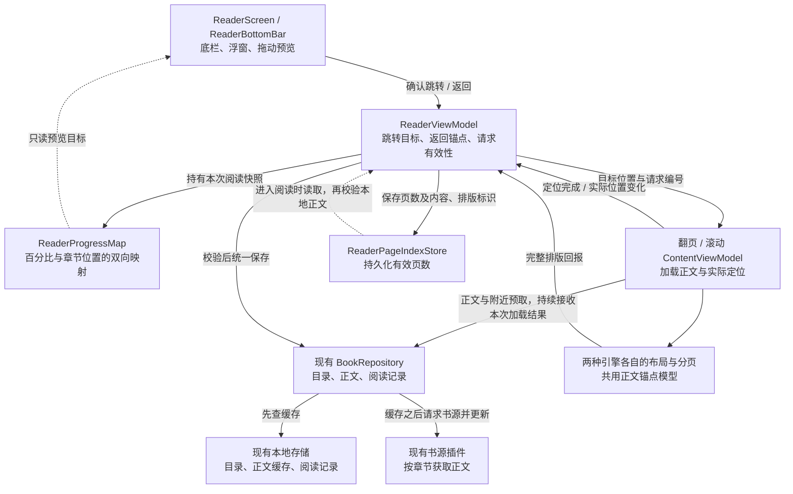
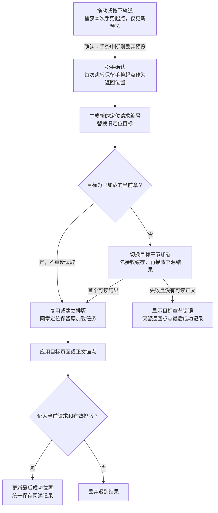

# 阅读器进度导航架构

更新日期：2026-09-29。本文说明当前实现、保存边界及验证入口；交互和视觉规格见 [阅读器底部控制区与全书进度条](reader-progress-design.md)。检查命令与验收要求不代表当前代码已通过全部验证。

复用现有 `ReaderViewModel`、翻页与滚动引擎、书籍仓库及书源插件。位置映射是纯计算，页数缓存是可丢弃的派生数据，不新增导航框架或插件公开接口。

## 1. 职责与数据流



页数随实际阅读和预读排版积累。当前没有独立扫描全书本地正文的后台补算器，也不会为了进度条触发整本下载。

| 单元 | 职责与边界 |
| --- | --- |
| `ReaderScreen` | 保存手势期间的临时预览值 ，从只读映射计算章节名和百分比 ；松手才提交目标 。不读取正文 、不写阅读记录 。主题直接取现有 `MaterialTheme.colorScheme` 。 |
| `ReaderViewModel` | 唯一的导航协调者与阅读位置保存出口 。持有当前映射 、最后成功位置 、一个返回锚点和当前请求编号 。目录 、上下章 、滑块和模式切换接入同一协调入口 ，只有滑块确认跳转才建立原位置点 。 |
| `ReaderProgressMap` | 根据目录顺序和章节权重完成双向映射，不联网、不保存、不分页。拖动时冻结当前映射，目录更新延后到手势结束应用，避免预览和执行使用不同目录。 |
| 两种阅读引擎 | 保留现有翻页与滚动实现 。加载目标章 ，等待目标布局 ，应用位置 ，回报实际位置及定位完成 。不直接写最后阅读章节或历史进度 。 |
| `BookRepository` | 沿用目录、正文与阅读记录接口。普通阅读保留缓存后刷新语义；仅读本地正文的入口用于校验已有页数缓存。 |
| 布局与页数缓存 | 翻页按实际分页，滚动按已测量正文与视口高度生成参考页数。定位锚点保留在引擎内存中，磁盘仅保存页数及有效性标识。 |

## 2. 一次跳转的执行顺序



数据返回、分页回报、定位回执和保存提交前分别检查有效性。普通滚动和翻页也通过同一保存出口报告实际位置；程序定位期间暂停普通进度保存，防止写入中间首屏。相邻章预取沿用引擎行为，只加载内容，不更新阅读位置。

加载与定位分别管理有效性 。已加载同章的跳转仅替换定位目标 ，不取消正在进行的正文加载 ，也不新增正文读取 。图中展示首次定位 ；后续书源结果按最新位置更新 ，不重新应用最初的跳转目标 。

正文加载成功不等于跳转完成 。只有当前目标可读且位置应用成功 ，才更新最后阅读章节与进度 。失败可以重试 ，也可以点击原位置点返回 ；返回成功后才清除该点 。

## 3. 最少的位置数据

| 数据 | 保存内容 | 生命周期 |
| --- | --- | --- |
| 导航目标 | 章节 ID ＋章内相对位置 ，或精确正文锚点 ；普通目录跳转继续支持历史位置恢复 | 单次跳转 |
| 正文锚点 | 章节 ID 、正文版本 、源组件序号 、文字偏移或图片内位置及视口偏移 | 当前成功位置与唯一返回位置 |
| 请求身份 | 阅读会话、引擎代次及定位请求编号 | 确认新目标、退出阅读或切换引擎时按各自生命周期更新，使旧回调失效 |
| 映射快照 | 有序章节及累计权重 | 拖动后在当前会话冻结权重，目录变更按章节身份重建 |
| 内存分页结果 | 页首锚点、页号或滚动几何 | 实际定位使用，随正文与排版失效 |
| 磁盘页数缓存 | `ReaderPageIndex` 保存 `layoutKey`、`contentKey`、`pageCount`，按来源和书籍隔离 | 后续会话建立权重使用，可丢弃重建 |

返回位置不保存为单一百分比 。相同内容与排版下可直接恢复页号或像素偏移 ，重排后按源正文锚点重新定位 。内置文字与图片保留可恢复位置 ；自定义插件组件只承诺其现有能力支持的定位粒度 ，内容变化后不能把旧组件序号直接套到新正文上 。

## 4. 分页索引与按需加载

- 目录就绪后即可建立映射 。有有效分页结果的章节采用真实页数 ，其余使用有效样本页数的中位数 ，无样本时等权 。估算标志仅供内部判断 ，视觉与无障碍播报统一显示 `61.5%` ，不添加“约” 。
- 翻页和滚动分别生成索引，排版键包含阅读模式、实际正文区域及影响布局的字体参数。翻页使用实际页面，内置图片沿用一图一页；滚动按正文实际几何与视口高度生成参考页数，图片采用实际布局高度。
- 正文经过与阅读相同的文本处理后再排版。分页结果来自实际阅读与预读布局，没有独立后台全书补算；普通跳转和附近预取负责按需获取，整本缓存沿用用户原有入口与设置。
- 首次加载有效缓存可在尚未拖动时修正估算映射；首次手势会取消未完成的初始化并冻结当时权重。后续分页回报只更新磁盘缓存，供下次进入阅读使用。目录变化在拖动期间延后应用；排版变化后保留正文锚点，旧权重作为当前会话估算，不随重新分页漂移。
- 磁盘缓存位于 App 私有缓存目录，使用现有 JSON 序列化和 `AtomicFile` 原子写入，互斥锁保护读改写。格式版本为 2，旧版本、应用版本不匹配、损坏或无效数据按无缓存处理。进入阅读时还需核对本地正文内容标识；旧缓存不迁移业务数据，之后从实际排版重建。缓存只保存页数，不持久化引擎定位锚点。
- 翻页的可读页与完整分页索引分开回报 。普通章首及已命中的历史位置在目标页解析后即可显示和保存源锚点 ；章中 、章末比例跳转仍等完整页数 ，精确锚点仅在已解析范围内提前恢复 。部分分页不写磁盘索引 、不记为章节完成 ，比例暂按源位置估算 ；完整分页只修正比例 ，不移动用户已读到的页面 。未解析页继续离屏测量 ，不能提前翻入 。
- 普通阅读及相邻预取消费 `getChapterContentFlow(...).collect` ，保留先缓存后书源刷新的行为 。公共 `preloadChapterContent` 保留直接请求书源并写入本地的契约 ，不与引擎邻章加载重复调用 。公开 Flow 的错误语义保持原实现 ，本次由阅读引擎处理刷新结果 。
- 后续结果正文相同时复用已解析组件 ，更新标题和前后章等元数据 ；只有前后章变化不重新分页 。滚动模式的标题变化使当前布局失效并重新定位 ，翻页正文分页不渲染标题 ，仅更新标题元数据 。正文变化后拒绝旧 `contentKey` 的精确锚点 ，按最新位置的章内比例回退定位 ，不重复最初的跳转 ，也不保证回到原句 。刷新失败或返回不可读正文时保留已有可读内容 ，没有可读内容时才显示章节错误 。ViewModel 内单项解析异常不阻断后续结果 ；上游 Flow 抛出异常时仅保证保留可读正文 ，不保证继续收集结果 ；协程取消继续向上传递 。滚动模式的磁盘分页索引另用正文与标题共同生成的版本标识 ，正文锚点仍只绑定正文版本 ；翻页模式的索引不受标题影响 。旧滚动索引不再命中 ，按原有估算与重新测量流程替换 ，不迁移业务数据 。

## 5. 保存与生命周期

- 阅读时长统计保留原有独立 IO 作用域 ，退出时的缓冲刷新不跟随阅读 ViewModel 一起取消 ；不改变统计算法或刷新信号 。
- 引擎只报告位置 ，`ReaderViewModel` 校验后统一调用现有阅读记录更新入口 。共享读改写使用原子更新 ，避免位置保存与阅读时长更新相互覆盖 。保存任务绑定捕获的来源 、书籍 、章节及请求身份 ，不在异步执行时从可变界面重新取标题 。
- 接受合法的 `0..1` 章内记录值 ，把“尚未定位完成”作为单独状态 。先更新目标章节的历史最高值 ，再按当前目录计算已读估算 ，不批量标记跳过的章节 ，返回不回滚最高值 。
- 各章 `locationHash` 按章暂存；滚动报告的 null 表示清除旧翻页位置。只有匹配的成功保存才清理待写批次，避免保存任务被取消后丢失其他章节的无效化。
- 普通导航恢复历史时，两种引擎统一读取当前会话中的最新进度及待写位置标记，缺失字段才回退到磁盘。快照在主线程取得，存储读取在 IO 线程执行，并校验书籍、来源与会话，避免快速换章后恢复到尚未更新的旧记录。
- 退出实际 Reader 回退栈项时 ，取消阅读任务 、使旧请求失效并清除返回点 。现有 ViewModel 属于父导航节点 ，不能仅依赖 `onCleared` ；主题设置 、看图 、收起菜单和进入后台也不能直接算作退出本书 。
- 切换翻页与滚动模式时 ，从旧引擎捕获当前成功的正文锚点 ，关闭旧引擎 ，再交给新引擎定位 。不使用可能落后的独立章节 ID 字段恢复 。

## 6. 可重复检查与验证边界

使用 JDK 21 并配置 Android SDK；离线命令要求本机已缓存项目依赖。在仓库根目录执行：

```sh
python3 scripts/check-reader-progress.py
python3 scripts/check-scroll-geometry.py
python3 scripts/check-reader-loading.py
python3 scripts/check-proxy-cache.py
sh ./gradlew :app:assembleDebug :benchmark:compileBenchmarkKotlin --offline
git diff --check
```

| 检查 | 能覆盖的范围 |
| --- | --- |
| `check-reader-progress.py` | 纯映射、端点、未知权重、单页、分页索引身份与手势判定，包括轨道、返回点、重叠触区、吸附和取消。 |
| `check-scroll-geometry.py` | 纯滚动几何、页偏移和位置计算，不执行 Compose 实际测量。 |
| `check-reader-loading.py` | 编译真实阅读引擎，使用仓库与 Compose 替身覆盖加载、刷新、任务取消、提前可读及定位状态，不执行真实布局、Room 或 HTTP。 |
| `check-proxy-cache.py` | 编译真实缓存代理，检查请求键隔离、命中、过期及优先级传递，不执行真实 HTTP。 |
| App / Benchmark 编译与打包 | 验证构建与测试源码能编译，不证明设备交互、网络次数或性能。 |
| `git diff --check` | 检查补丁空白错误，不替代代码审查。 |

设备回归复用现有 `benchmark` 模块的 `BookAndReaderTest`。连接设备后可按本次修改选择相关方法；完整阅读测试类命令如下：

```sh
sh ./gradlew :benchmark:connectedBenchmarkAndroidTest -Pandroid.testInstrumentationRunnerArguments.class=indi.dmzz_yyhyy.lightnovelreader.benchmark.book.BookAndReaderTest
```

设备验收包含两种阅读模式的同章与跨章跳转、连续请求、返回点生命周期、错误重试、配置重建、延迟图片、模式切换及历史恢复。视觉与输入验收还需覆盖固定浮窗在长短标题和 0.0%–100.0% 间的稳定性、主题、大字体、窄屏、安全区、TalkBack、键盘及系统手势中断。

`BENCHMARK` 配置缓存命中后提前返回，相关用例不能独立证明普通构建的缓存后刷新。真实网络读取次数须在非 `BENCHMARK` 构建下分别统计正文 Flow 订阅、书源章节调用与实际 HTTP 请求。退出统计实际落库、真机帧表现和网络时序也需各自证据；模拟器与网页预览不能替代真机验证。

独立版本的构建命令、包名与更新策略见 [独立开发与打包](independent-development.md)。本文不记录易过时的本机路径、设备连接状态或历史构建成功结论；提交时按当前代码实际执行的检查报告结果和未验证项。
